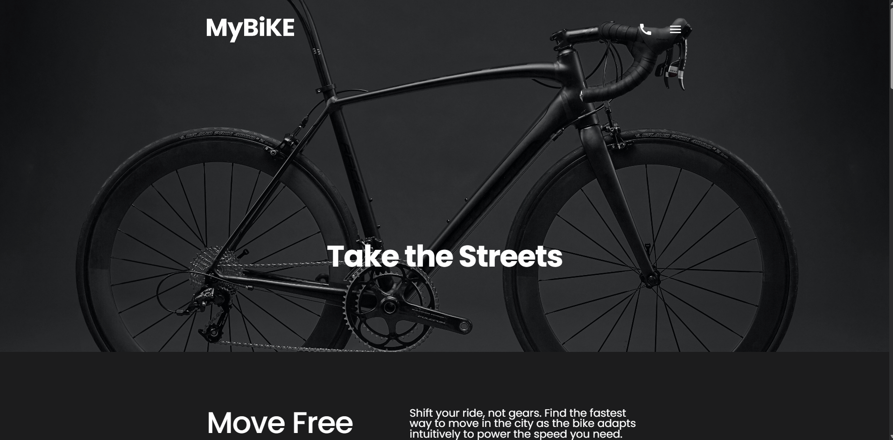
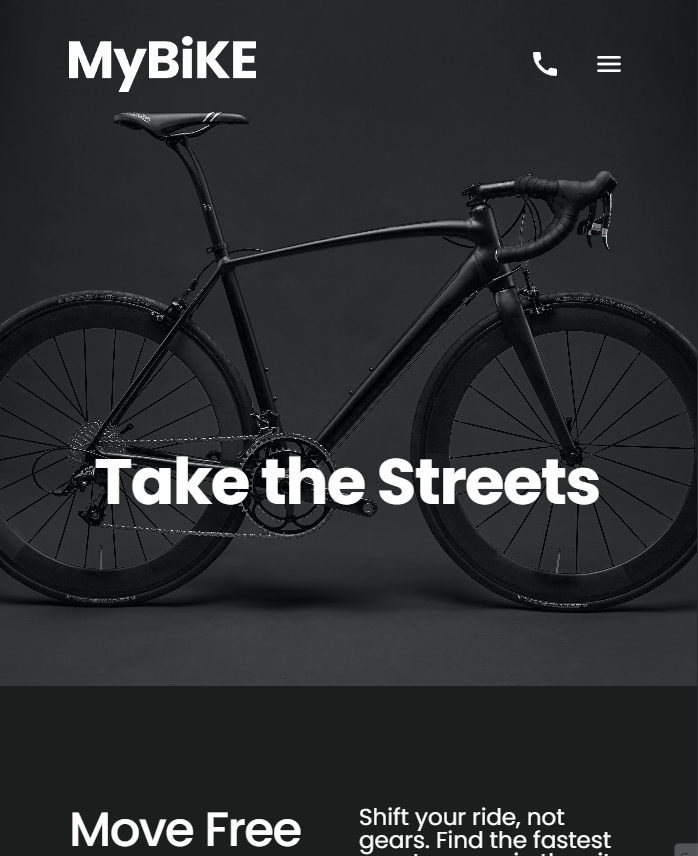
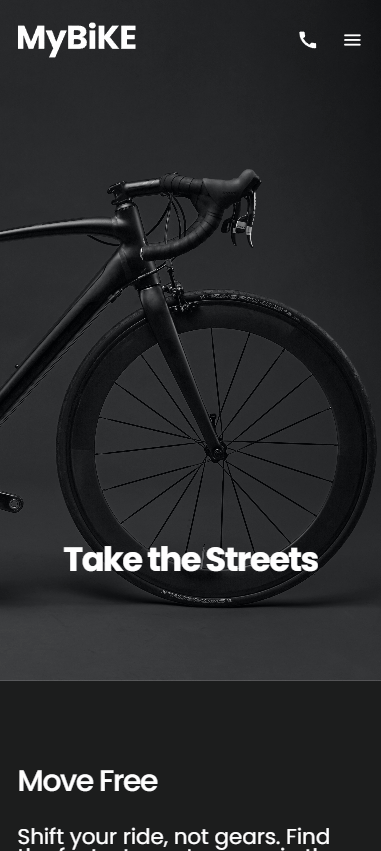

🚀 Responsive Landing Page
This is a modern and clean landing page project built to showcase front-end development skills, focusing on responsive design, clean code, and user experience.

Project Status: 🟢 Completed

💻 About the Project
The main goal of this project was to create a professional landing page that adapts perfectly to any screen size. It explores modern CSS techniques like Flexbox and Grid to ensure a fluid and intuitive layout.

🛠 Technologies Used
 - HTML5: Semantic structuring for better SEO and accessibility.

 - CSS3 and SASS: Custom styling, variables, and animations.

 - Flexbox & Grid: Used for complex and responsive positioning.

 - Mobile-First Workflow: Ensuring a great experience on smartphones before scaling to desktop.

🎨 Preview

---

---

 - Check out the live version here: https://lucasmaximilianonovo.github.io/landing-page-MyBike/

✨ Key Features
[x] Fully Responsive: Optimized for mobile, tablet, and desktop.

[x] Semantic HTML: Clean and readable code structure.

[x] Interactive UI: Smooth hover effects and navigation.

🚀 Getting Started
To run this project locally, follow these steps:

Clone the repository:

git clone https://github.com/LucasMaximilianoNovo/layout_landing-page.git

Navigate to the project folder:

cd layout_landing-page
Open the project: Simply open the index.html file in your favorite browser or use the "Live Server" extension in VS Code.

👤 Author
Developed by Lucas Maximiliano.

LinkedIn: https://www.linkedin.com/in/lucasmaximilianonovo/
